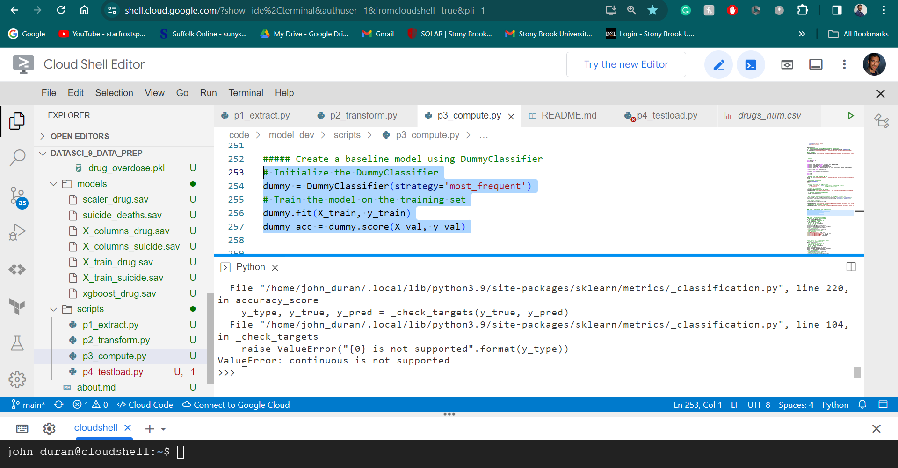

# datasci_9_data_prep
HHA 507 Assignment 9 

# Extract 

I found two datasets that I used for this machine learning assignment. One is of them is of Drug overdose death rates, by drug type, sex, age, race, and Hispanic origin using information all over the United States. The second is of Death rates for suicide, by sex, race, Hispanic origin, and age using information all over the United States. After extracting both datasets from their api endpoints I made both into pickel formats and stored them in the raw data folder.

# Transform

This stage would be the data cleaning stage that would allow me to use it later on for machine learning computation. In my case I didn't have to do too much data cleaning as the datasets I used already had columns that were ready for machine learning purposes. All of those columns have the same name as the orginal ones, but have the abbreviation 'STUB' or 'NUM" in front of or at the end of the words to distinguish them. 

There was already data cleaning and categorical encoding done on these datasets.

However, if I were to do the data cleaning and enconding myself then I would perform the following steps. 
1. I would lowercase all the column names and replace any white spaces with an underscore as this could cause issues later on. 
2. Use df.dtypes to see what kind of data types I am dealing with in these datasets to make sure I know how to deal with them. Since for instance I might want to make sure that a date column is in fact stored as an integer. 
3. Using .drop I would create a list of columns that I would drop from the datasets that I wouldn't need in order to have a more clean dataset.
4. Encoding and creating my own data dictionary to create a dataframe conatining one human readable column and one column for the numerical number equivalent. For example, the year 1999 is assigned to the integer '1' for the drug overdose dataset. This can be done using an ordinal encoder within scikit-learn. 
5. Once the encoding is down I put each of the numerical and human readable columns in their own csv files. Finally I combined all the numerical columns into once csv file for each of the datasets. 

# Compute

In this section I distinguised what the independent and dependent variables were for each of the datasets. For the drug_overdose the dependent variable was sex and for suicide_death it was also sex. 

Here the dataframes will be transformed in order for all the columns to be set on an equal range. 

Next three different datasets were created for training, validation and testing. 
Dataset 1 Models Created:

Dataset 2 Models Created:

I did run into an issue when trying to create the dummy baseline model as it kept saying 'continous is not supported'. However, I realized later on that I didn't need to go further anyways for this assignment. 

# Testload 

As with the test load since the models didn't work as prviously mentioned so didn't the test load either. 

# Errors

Since I kept exeriencing the 'continous is not supported' error I wasn't able to properly go through the rest of the different models like xgboost and see just how accurate my dataset was in prediction. I suspect it might have something to do with how my dependent variable doesn't just contain two options in its column but multiple. 
